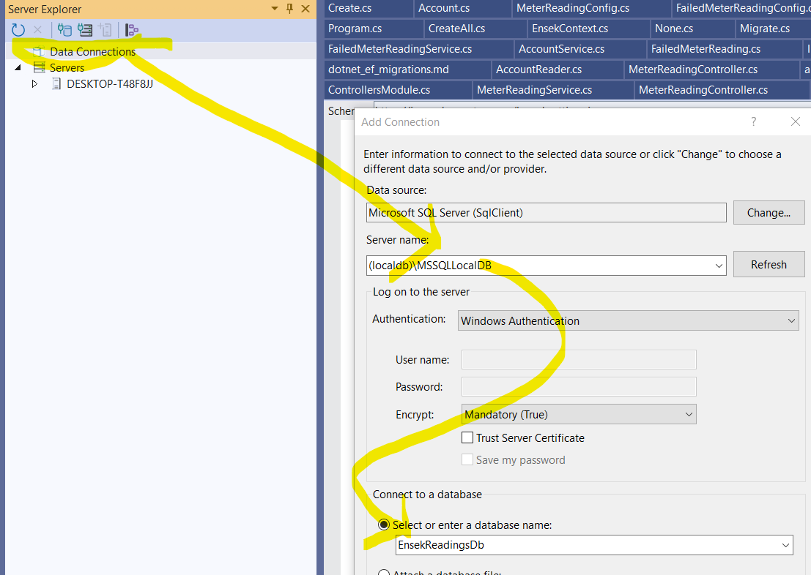
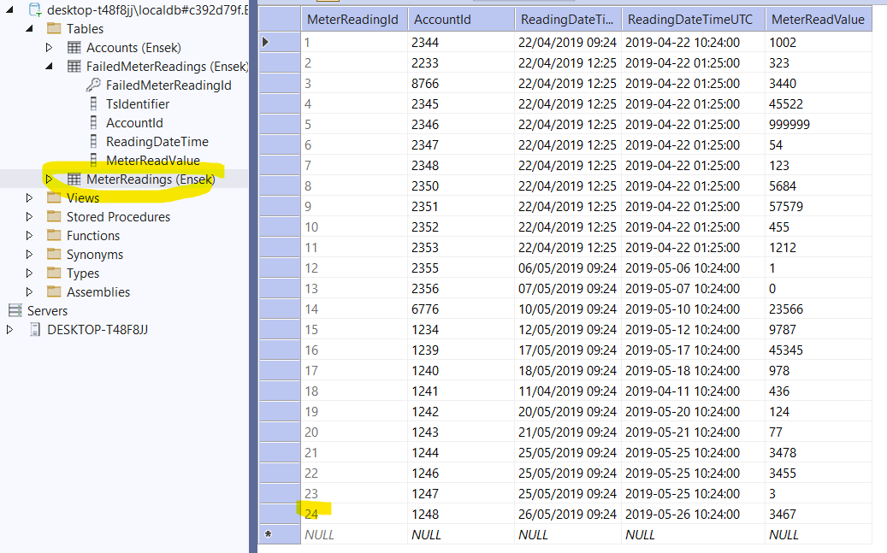
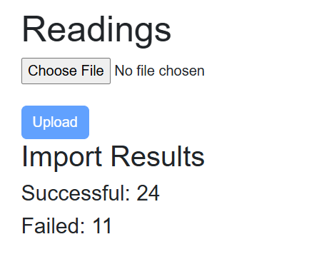

# Ensek Remote Technical Test
- To demonstrate a Web API that allows the upload of a customers `Meter Reading CSV` file

## Must Have:
- Create the following endpoint:
  - `POST => /meter-reading-uploads`
  - **Q**: What sort of payload will this be taking ?
  - **A**: Assume `IFormFileCollection` for now, so that it can track what file may have caused failures.

- The endpoint should be able to process a CSV of meter readings.
  - An example CSV file has been provided (Meter_reading.csv)
  - **Q**: What should be done with rows that have extra data entries
  = **A**: If the previous entries can be used then do so!

- Each entry in the CSV should be validated and if valid, stored in a DB.
  - **Q:** What should be done when the values (i.e. dateColumn) are not in the correct format ?
  - **A:** See Next, A record of failed reading should be kept, and returned.

- After processing, the number of successful/failed readings should be returned.

## Validation: 
- You should not be able to load the same entry twice
  - **Q:** Should an error be returned 
  - **A:** See Above, A record of failed reading should be kept, and returned.

- A meter reading must be associated with an Account ID to be deemed valid
  - **Q:** What should be done with the invalid account reference data ?
  - **A:** See Above, A record of failed reading should be kept, and returned.

- Reading values should be in the format NNNNN
  - **Q:** What should be done when the values are not in this format ?
  - **A:** See Above, A record of failed reading should be kept, and returned.
  - **Q**: What should be done about values that a lower, at a later date ?
  - **A**: ?
  - Notes: 
      - Negative values are also a failure
      - No Batch insert due to requirement to have individual failure lines (This is an ETL style ingest)
      - DateTime format is assumed to be `dd/MM/yyyy hh:mm` enUk 24hour UTC zero padding!

## Nice To Have:
- Create a client in the technology of your choosing to consume the API. 
  - You can use angular/react/whatever you like

- When an account has an existing read, ensure the new read isn’t older than the existing read

# Assumptions
- Visual Studio 17.12
- Sql LocalDB installed
- Each project will have analyzers for security and "others" to enhance the default(s) of Rosylyn.
- Database has been Created (Migrated) via the `Ensek.Database.Builder` application
  - 
  - `(localdb)\MSSQLLocalDB`
  - Note that this **deletes** the entire database and reseeds the accounts table!
- DateStamps in the CSV file are in UTC (If valid!)
- `nuget` packages should not be "Copy-Left" style licenses!

## Architecture / Design Styles
- Authentication and User Access (in general), is beyond the scope of this. Therefore:
  - No need for `[Authorize]` attributes etc on the controller API(s)
  - And, no need for security checks within the `Services` implementation classes either.
  - Add `#pragma warning disable SCS0016` to each controller file.
- No versioning to be used in API checking etc.
- CQRS will not be adhered to, but, Readers and Writers will be in separate classes

### Database
- Entity Framework used for DB creation / Migrations / Table access
- Migrations / Contexts / Models / Access are **all** in separate projects, to ensure SOLID principles

### Service
- Controllers / Services / Data access to be in sepearate projects to allow testing and SOLID principles
- Use [TimeSortableId](https://github.com/kgkoutis/TSID.Creator.NET), for Logging moniker tracking (Time Permitting!), and tracking "Failed" reading storage

### Client
- Will be a blazor pages app
- Will not have localisation applied

### Testing
- Try not to use mocking: the database exists; Use it!
- Use `FluentAssertions` to abstract test conditions away from Test runner style
- Use same code quality practices (Apart from a few exceptions in the `.editorConfig` file)
- 
- 

# To Do's
- Use the `FileSignature` to check (both sides) that the csv file is real and not too big (OWASP)
- Add a UI command to get the `FailedMeterReadings` (and Testing)

# Work Progress
## Wednesday
- About 3 hours in the morning
### Commit 1
- Create ReadMe.md
- Create solution layout
- Add default solution items
- Make sure it builds

## Thursday Morning
- About 3 hours in the morning
### Commit 2
- Add code to perform Database "SOLID" style projects
- Some more skeleton code to perform "Readings" Ingest
### Commit 3
- Update the Client to send the file
### Commit 4
- Update Readme with messages of what still needs to be done !

## Thursday Afternoon
- About 4 hours
### Commit 5
- Get the Table Seed data done via Ensek.Database.Builder application
### Commit 6
- Change CSV Helpers default to not throw exception on conversion failure
- Get the results serialised back to the client
### Commit 7
- Need another type of CSV reader that can give the line data as there are 3 missing lines !

## Thursday Evening
- Just over 2 hours
### Commit 7
- Add Some testing methodologies
- Fix the usage of the single source in the Controllers
- Add a bit more Error handling
- Fiddle with the appSettings

## Friday Morning
- Only 1.5 hours to go !
### Commit 8
- ReadMe update
- fix Some Compile warnings
### Commit 9
- Add a Test project that demonstrates using a real database and not mocking
